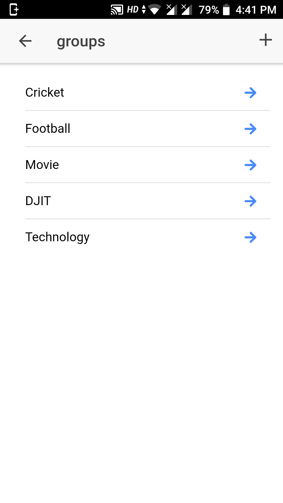
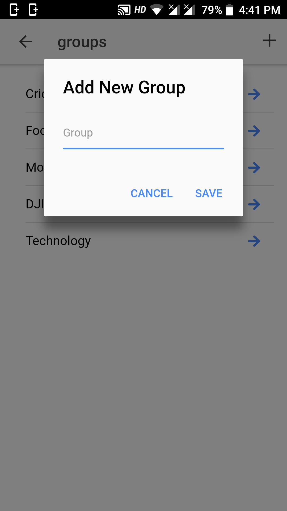
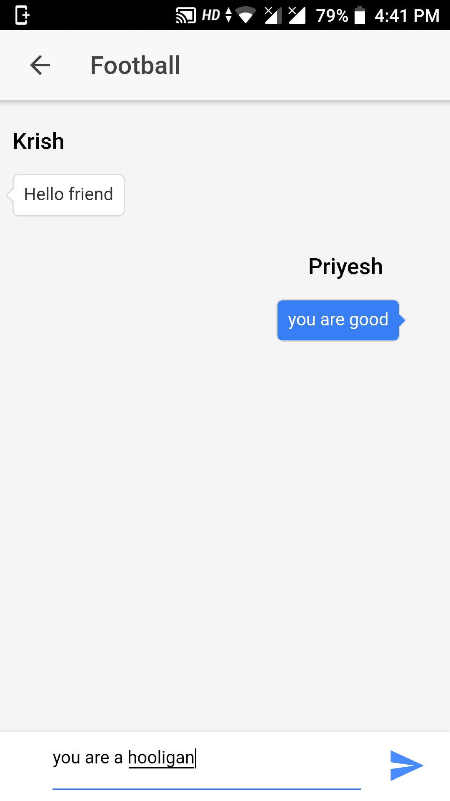
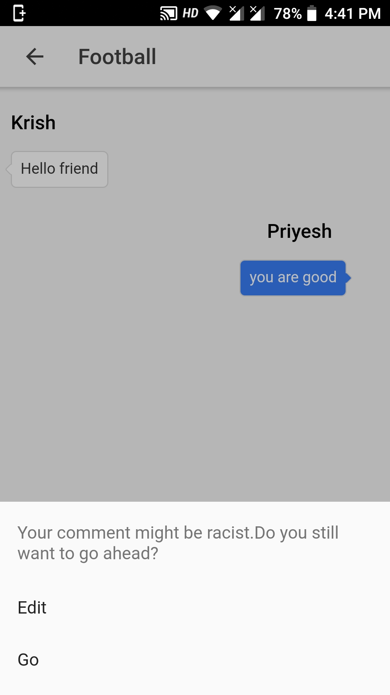
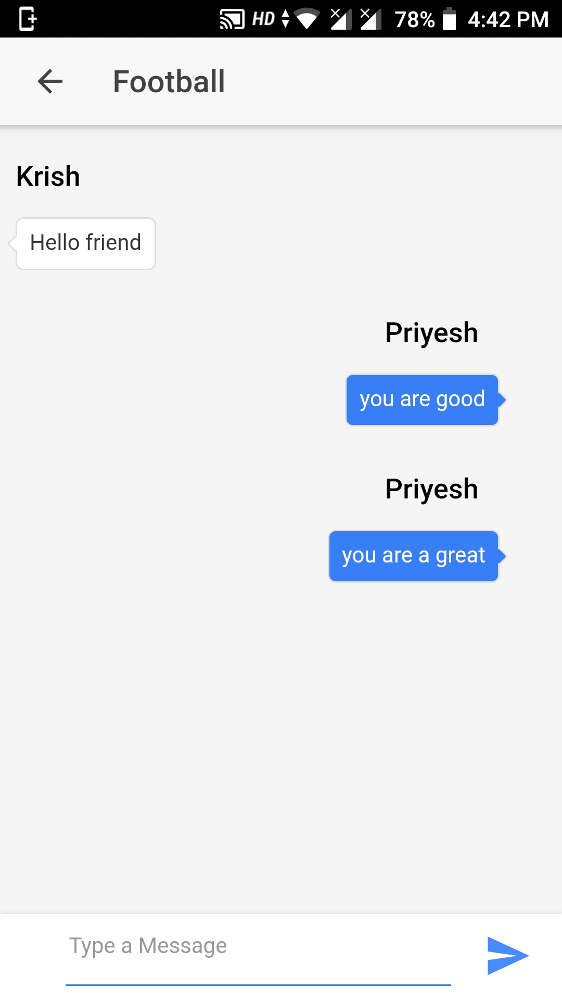

### Cyber Bullying prevention app using Ionic 3 framework and Api.ai/Dialogflow

`git clone`  
cd into folder
`npm install`  
create a empty file in `node_modules/api-ai-javascript/index.js.map`  
make a environment.ts file in src/ and put your api key.
```
export const environment = {
    token: "key"
}
```
`ionic serve` for a dev server.

Train your AI at DialogFlow according to your key words.





